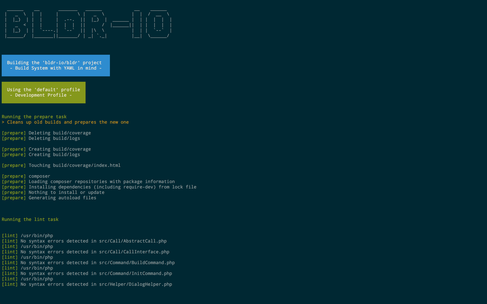
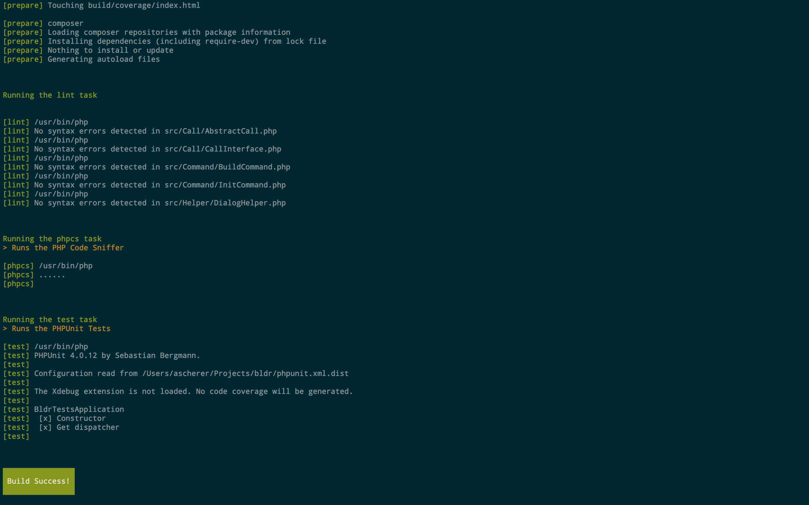

Welcome to Bldr's documentation!
^^^^^^^^^^^^^^^^^^^^^^^^^^^^^^^^

Bldr, in the simplest terms, is a task runner, and an awesome one at that. It was written with simpler configs in mind. If you are used to build systems,
you've probably seen some pretty complicated build files, and they were probably written in xml that is clunky and a pain to maintain.

Well, here's one written for Bldr using yaml (json is also supported):

**This is a sample configuration. Your project may not have the dependencies required to run this configuration.**

.. code-block:: yaml

    bldr:
        name: bldr-io/bldr
        description: Super Extensible and Awesome Task Runner

        profiles:
            default:
                description: 'Development Profile'
                tasks:
                    - prepare
                    - lint
                    - phpcs
                    - test

        tasks:
            prepare:
                description: Cleans up old builds and prepares the new one
                calls:
                    -
                        type: filesystem:remove
                        files: [build/coverage, build/logs]
                    -
                        type: filesystem:mkdir
                        files: [build/coverage, build/logs]
                    -
                        type: filesystem:touch
                        files: [build/coverage/index.html]
                    -
                        type: exec
                        executable: composer
                        arguments: [install, --prefer-dist]
            lint:
                describe: Lints the files of the project
                calls:
                    -
                        type: apply
                        failOnError: true
                        src:
                            - { path: [src, tests], files: *.php, recursive: true } # Checks src and tests directories for *.php files recursively
                        executable: php
                        arguments: [-l]

            phpcs:
                description: Runs the PHP Code Sniffer
                calls:
                    -
                        type: exec
                        executable: php
                        arguments:
                            - bin/phpcs
                            - -p
                            - --standard=build/phpcs.xml
                            - --report=checkstyle
                            - --report-file=build/logs/checkstyle.xml
                            - src/
            test:
                description: Runs the PHPUnit Tests
                calls:
                    -
                        type: exec
                        failOnError: true
                        executable: php
                        arguments:
                            - bin/phpunit
                            - --testdox
                            - --coverage-text=php://stdout

And here's the output:

For now (while im still working on the documentation), this will hopefully serve as ample documentation.

Content
========

.. toctree::
    :maxdepth: 2

    installation
    configuration
    usage
    blocks
    creating-a-block
